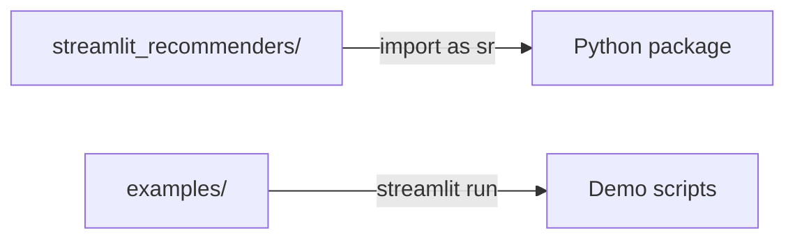
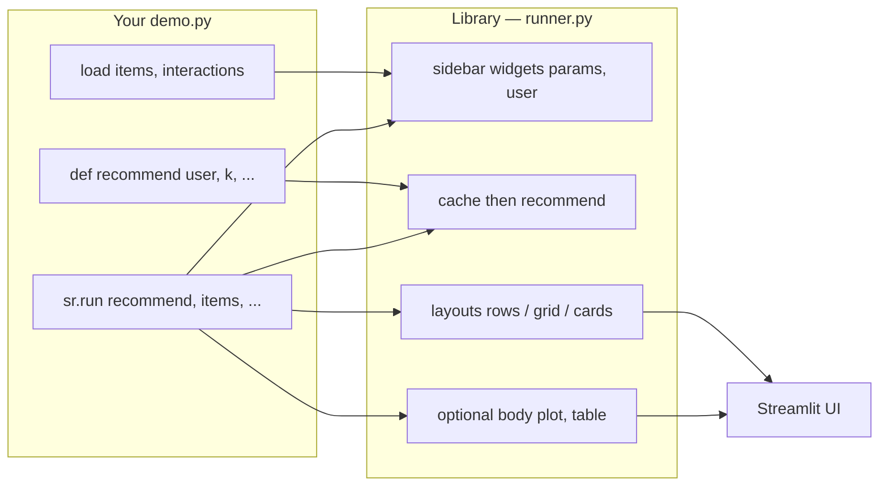
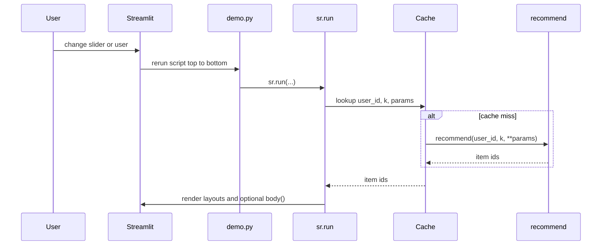
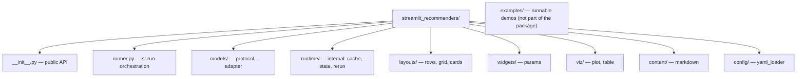

# streamlit_recommenders

Lightweight Python library for **interactive demo and evaluation of recommender systems** in Streamlit. Target users: **researchers and mathematicians** who **write their own Python code** — load data, implement scoring, run a demo. The library saves Streamlit boilerplate, not the math.

**[Capabilities (API + demos)](docs/CAPABILITIES.md)** | **[Interfaces & contracts](docs/CONTRACTS.md)** | Showcase: `.venv/bin/streamlit run examples/showcase_demo.py`



---

## Project goal

Let a researcher write **one `.py` file** (or a small module) where they:

1. **Load data and weights** — `pd.read_csv`, `np.load`, `torch.load`, paths on disk.
2. **Implement recommendation logic** — plain Python: numpy, custom classes, existing notebook code.
3. **Call the library** — layout, widgets, charts, markdown; the rest runs automatically.

This is not a training framework or production serving. It is a **thin presentation layer** — the researcher writes the model, the library writes Streamlit.

---

## What the researcher writes vs. what the library handles

| Researcher writes (public API) | Library handles internally (hidden) |
|--------------------------------|-------------------------------------|
| Load data and weights from disk | `@st.cache_data` / `@st.cache_resource` for data and models |
| Function or class `recommend(user_id, k, **params)` | Adapter + cache invalidation on param change |
| Calls `sr.rows(...)`, `sr.plot(...)`, `sr.markdown(...)` | Layout, rerun logic |
| Params via `sr.slider(...)` or YAML | Widget -> `**params`, `st.session_state` |
| Optional custom section in `demo.py` | Session storage, click history, rerun state |

**Principle:** The demo script should read like **a notebook converted to `.py`** — clear, no Streamlit magic. All `st.cache_*`, `session_state`, fragments, and rerun optimizations belong **in the library**, not in the researcher's demo file.

---

## Target users and UX principles

| Principle | Meaning |
|-----------|---------|
| **Code-first** | Main path = Python script, not UI file upload |
| **Ready to use** | `pip install` + ~30 lines of clear code -> running demo |
| **Zero Streamlit boilerplate** | Researcher does not import `streamlit`, does not manage cache/state/rerun |
| **Convention over configuration** | Sensible defaults; YAML only for repeated param blocks |
| **Easily extensible** | New layout = one function; new model = one function with a fixed signature |
| **Simplicity first** | Minimum abstractions outward; complexity only inside the library where needed (see `.cursor/skills/SKILL.md`) |

---

## Requirements

### Must have (MVP)

#### 1. Recommendation display (Items)

Show recommended items in three layouts:

- **Rows** — Netflix-like horizontal rows
- **Grid** — e-shop grid
- **Cards** — shopping-app cards with image and metadata

Item metadata must be **trivial to pass** — ideally as pandas `DataFrame` columns (title, image URL, description, price, …). Layouts pick columns from config or convention (`title`, `image_url`, …).

#### 2. Model — top 3 ways the researcher **writes it in code**

Not UI weight upload. The researcher loads files and implements logic in `demo.py`. The library defines a **simple contract** and three common patterns:

| # | Pattern | Typical researcher code | When to use |
|---|---------|-------------------------|-------------|
| **A** | **Function / class** *(primary)* | `def recommend(user_id, k, alpha=0.5): ...` or class with `.recommend()` | Custom scoring, dynamic params, experiments |
| **B** | **Trained object** | `model = joblib.load("model.pkl")` + thin wrapper | Sklearn / serialized custom class on disk |
| **C** | **Precomputed scores** | `scores = pd.read_parquet(...)` + lookup in `recommend()` | Offline eval, static demo, quick prototype |

All three go through the same **adapter** — the rest of the library only calls `recommend(user_id, k, **params)`.

```python
# Pattern A — typical researcher demo (~30 lines)
import numpy as np
import pandas as pd
import streamlit_recommenders as sr

ITEMS = pd.read_csv("data/items.csv")
INTERACTIONS = pd.read_csv("data/interactions.csv")
USER_EMB = np.load("artifacts/user_emb.npy")
ITEM_EMB = np.load("artifacts/item_emb.npy")

def recommend(user_id: int, k: int, alpha: float = 0.5) -> list[int]:
    scores = USER_EMB @ ITEM_EMB.T
    seen = set(INTERACTIONS.loc[INTERACTIONS.user_id == user_id, "item_id"])
    ranked = np.argsort(scores)[::-1]
    return [i for i in ranked if i not in seen][:k]

sr.run(
    recommend=recommend,
    items=ITEMS,
    layout="rows",
    params={"alpha": sr.slider("alpha", 0.0, 1.0, 0.5)},
)
```

#### 3. Interactive controls (sliders / steering)

- Streamlit widgets for **model param tuning** (e.g. `alpha`, `k`, `temperature`).
- Params defined either **imperatively** (`sr.slider(...)`) or **declaratively** (YAML).
- Param change -> recompute and show new recommendations immediately.

#### 4. Visualizations

```python
sr.plot(df)   # pandas DataFrame -> interactive Plotly chart
sr.table(df)  # pandas DataFrame -> formatted table
```

- Primarily **pandas**; polars as a future extension.
- Charts support multiple axes via `x`, `y`, `color` params or conventions.

#### 5. Markdown / supplementary material

Demos often include method description, paper links, math formulas.

**Recommended approach:** Streamlit flow + generated markdown (not MD templates with embedded widgets).

#### 6. Declarative YAML config for repeated blocks

Instead of hand-writing widgets for every parameter — see `examples/demo_config.yaml`.

### Nice to have (post-MVP)

- Interaction history affecting recommendations over time
- Polars backend for `plot()` / `table()`
- Metrics HR@k, NDCG@k, coverage
- Session export as JSON

---

## Architecture

### How it fits together



| You provide | Library handles |
|-------------|-----------------|
| `items` DataFrame (catalog + metadata) | Join ids -> titles, images |
| `interactions` DataFrame (optional) | User selectbox in sidebar |
| `recommend(user_id, k, **params)` | Cache, adapter, call on param change |
| `params={...}` or YAML | Sliders / selectboxes in sidebar |
| `body()` callback (optional) | Extra charts, tables, markdown |

### One rerun (slider or user change)



### Public API -> modules

| `import streamlit_recommenders as sr` | Module |
|---------------------------------------|--------|
| `sr.run()` | `runner.py` |
| `sr.load_items()`, `sr.load_interactions()` | `runner.py` + `runtime/cache.py` |
| `sr.slider()`, `sr.selectbox()` | `widgets/params.py` |
| `sr.rows()`, `sr.grid()`, `sr.cards()` | `layouts/` |
| `sr.plot()`, `sr.table()` | `viz/` |
| `sr.markdown()`, `sr.markdown_file()` | `content/` |
| `config=` YAML | `config/yaml_loader.py` |

Everything under `runtime/`, `models/adapter.py` is internal — see [docs/CONTRACTS.md](docs/CONTRACTS.md).

### Directory layout



See [docs/CAPABILITIES.md](docs/CAPABILITIES.md) for the full public API.  
See [docs/CONTRACTS.md](docs/CONTRACTS.md) for formal interfaces (recommender, data schemas, params, planned metrics).

---

## What this library is **not**

- Not a training pipeline
- Not a production API (no auth, rate limiting, A/B tests)
- Not a general Streamlit framework — only the recommender demo use case

---

## Open questions

- **Package name `streamlit_recommenders`** — OK for PyPI? Alternatives: `streamlit-recsys`, `recsys-demo`, `st-recommenders`.
- **Plotly vs Altair** — Plotly as default; Altair optional later.
- **`sr.run()` vs free-form script** — support both or only `sr.run()` in MVP?

---

## License

TBD
