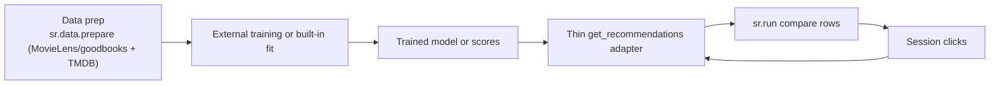

# Architecture

Module-level view of how a demo flows through the public API, runtime state, layouts, and Streamlit UI.

```mermaid
flowchart TB
  subgraph demo["Your demo.py"]
    data["items DataFrame\ninteractions DataFrame"]
    external["optional external training\nRecBole · Cornac · RecPack · LensKit"]
    rec["get_recommendations(user, k, **params)\nfunction · class · dict of models"]
    app_call["sr.run(get_recommendations, items, params, body)"]
    data --> app_call
    external --> rec
    rec --> app_call
  end

  subgraph api["Public API: import streamlit_recommenders as sr"]
    run["run() · load_items() · load_interactions()"]
    layout_fn["rows() · grid() · cards()"]
    viz_fn["plot() · table() · markdown()"]
    state_fn["selected_items() · current_user() · param_value()"]
    models_fn["Base · Artifact\nItemKNN · EASE · SequentialCF"]
  end

  subgraph runner["runner.py: orchestration"]
    sidebar["sidebar: user picker + params"]
    sections["per recommender: cache -> carousel -> Get Recommendations"]
    body_hook["optional body() callback"]
  end

  subgraph models["models/"]
    adapter["adapter.py: normalize fn / .get_recommendations()"]
    protocol["RecommenderProtocol"]
  end

  subgraph runtime["runtime/: internal"]
    cache["cache.py: cache_data on get_recommendations()"]
    state["state.py: selected_ids, displayed_recs"]
    seen["seen.py: effective_seen(), session user"]
    compare["compare.py: dict -> labeled rows"]
  end

  subgraph layouts["layouts/"]
    card["item_card.py: poster button"]
    section["section.py: carousel/swipe deck + Get Recommendations btn"]
    modes["rows · grid (click) · cards (swipe)"]
  end

  subgraph widgets["widgets/"]
    params["params.py: slider, selectbox"]
    profile["profile_strip · user_profile"]
  end

  subgraph ui["Streamlit page"]
    strips["Past interactions · Selected this session"]
    carousel["Clickable poster cards"]
    get_recommendations_btn["Get Recommendations"]
    extra["plots · tables · markdown"]
  end

  app_call --> run
  run --> sidebar
  run --> sections
  run --> body_hook
  sections --> adapter
  adapter --> rec
  sections --> cache
  cache --> adapter
  sections --> state
  sections --> compare
  sections --> section
  section --> card
  section --> modes
  sidebar --> params
  sidebar --> profile
  section --> carousel
  profile --> strips
  section --> get_recommendations_btn
  body_hook --> viz_fn
  viz_fn --> extra
  models_fn --> adapter
```

**Flow:** sidebar params + user -> cached `get_recommendations()` adapter -> item ids -> poster carousel. Card click updates session state; **Get Recommendations** refreshes compared rows.

## Boundary

The library owns the interactive inspection layer, not the full model-training pipeline. Training frameworks standardize offline experimentation; `streamlit-recommenders` standardizes how trained recommenders are displayed, compared, and probed with session feedback.

Data preparation lives inside the library (`streamlit_recommenders/data/prepare/`): `prepare_movielens` / `prepare_goodbooks` download and normalize into the local schema, TMDB enrichment is robust (retry/backoff, completeness report), and a `dataset.json` manifest (`is_complete`) makes preparation idempotent so a finished dataset is not re-collected before a run.

Core baselines stay lightweight and citeable: `ItemKNNRecommender`, `EASERecommender`, and `SequentialCFRecommender`. Heavy frameworks such as RecBole, Cornac, RecPack, LensKit, and Elliot should be optional example integrations rather than required dependencies.
