# Architecture

Module-level view of how a demo flows through the public API, runtime state, layouts, and Streamlit UI.

```mermaid
flowchart TB
  subgraph demo["Your demo.py"]
    data["items DataFrame\ninteractions DataFrame"]
    rec["recommend(user, k, **params)\nfunction · class · dict of models"]
    app_call["sr.run(recommend, items, params, body)"]
    data --> app_call
    rec --> app_call
  end

  subgraph api["Public API: import streamlit_recommenders as sr"]
    run["run() · load_items() · load_interactions()"]
    layout_fn["rows() · grid() · cards()"]
    viz_fn["plot() · table() · markdown()"]
    state_fn["selected_items() · current_user() · param_value()"]
    models_fn["EmbeddingPopularity · ItemKNN · EASE\nSequentialCF · Popularity · Random"]
  end

  subgraph runner["runner.py: orchestration"]
    sidebar["sidebar: user picker + params"]
    sections["per recommender: cache -> carousel -> Recommend"]
    body_hook["optional body() callback"]
  end

  subgraph models["models/"]
    adapter["adapter.py: normalize fn / .recommend()"]
    protocol["RecommenderProtocol"]
  end

  subgraph runtime["runtime/: internal"]
    cache["cache.py: cache_data on recommend()"]
    state["state.py: selected_ids, displayed_recs"]
    seen["seen.py: effective_seen(), session user"]
    compare["compare.py: dict -> labeled rows"]
  end

  subgraph layouts["layouts/"]
    card["item_card.py: poster button"]
    section["section.py: carousel + Recommend btn"]
    modes["rows · grid · cards"]
  end

  subgraph widgets["widgets/"]
    params["params.py: slider, selectbox"]
    profile["profile_strip · user_profile"]
  end

  subgraph ui["Streamlit page"]
    strips["Past interactions · Selected this session"]
    carousel["Clickable poster cards"]
    recommend_btn["Recommend per row"]
    extra["plots · tables · markdown"]
  end

  app_call --> run
  run --> sidebar
  run --> sections
  run --> body_hook
  sections --> adapter
  adapter --> rec
  sections --> cache
  cache --> adapter
  sections --> state
  sections --> compare
  sections --> section
  section --> card
  section --> modes
  sidebar --> params
  sidebar --> profile
  section --> carousel
  profile --> strips
  section --> recommend_btn
  body_hook --> viz_fn
  viz_fn --> extra
  models_fn --> adapter
```

**Flow:** sidebar params + user -> cached `recommend()` -> item ids -> poster carousel. Card click updates session state; **Recommend** recomputes that row.
