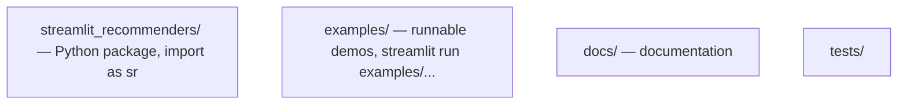

# streamlit_recommenders capabilities (MVP)

Practical overview of the implemented API. Architecture and design: [README.md](../README.md).  
Formal interfaces: **[CONTRACTS.md](CONTRACTS.md)**.

## Project structure



**No `app.py` in the project root.** Library ≠ demo. Demo scripts live in `examples/`.

## Running

**Requires Python ≥3.10 and the package installed in the same env as Streamlit.**

```bash
python3.11 -m venv .venv
.venv/bin/pip install -e ".[dev]"
.venv/bin/python examples/generate_sample_data.py   # one-time setup

# recommended — always uses the correct Python + package:
./scripts/run_demo.sh

# or explicitly:
.venv/bin/streamlit run examples/showcase_demo.py
```

**Note:** System-wide `streamlit run ...` (e.g. Python 3.8) **will not work** — the package is not installed there.

---

## Public API

| Function | Description |
|----------|-------------|
| `sr.run(...)` | Full app: sidebar, recommendations, optional `body` |
| `sr.load_items(path)` | Load item catalog (cached) |
| `sr.load_interactions(path)` | Load interactions (cached) |
| `sr.slider(...)` | Define a slider param, pass in `params={}` |
| `sr.selectbox(...)` | Define a selectbox param, pass in `params={}` |
| `sr.rows(items, rec_ids)` | Netflix-like row |
| `sr.grid(items, rec_ids)` | E-shop grid |
| `sr.cards(items, rec_ids)` | Cards with metadata |
| `sr.plot(df, x=, y=, color=)` | Plotly chart from pandas DataFrame |
| `sr.table(df)` | Table from pandas DataFrame |
| `sr.markdown(text)` | Markdown + LaTeX |
| `sr.markdown_file(path)` | Load a `.md` file |

## Model contract

Full specification: **[CONTRACTS.md](CONTRACTS.md)** (recommender, items, interactions, params, metrics).

The researcher implements one function (or an object with `.recommend()`):

```python
def recommend(user_id, k: int, **params) -> list[item_id]:
    ...
```

Three typical patterns (see `examples/`):

| Pattern | File | How |
|---------|------|-----|
| **A — custom function** | `minimal_demo.py` | numpy/pandas scoring in `recommend()` |
| **B — joblib object** | `pickle_demo.py` | `joblib.load()` + thin wrapper |
| **C — precomputed matrix** | `matrix_demo.py` | lookup in a scores DataFrame |

## What `sr.run()` handles for you

- Streamlit page config, sidebar (user + params)
- Cache on `recommend()` — recomputes only when params / user change
- Session state — item clicks (`Saved this session: ...`)
- YAML config (optional) — params, layout, column mapping

### `sr.run()` parameters

```python
sr.run(
    recommend=fn,              # required
    items=df,                  # required — catalog with metadata
    interactions=df,           # optional — user picker + filter seen items
    layout="rows",             # rows | grid | cards (or from YAML / params)
    params={"alpha": sr.slider(...)},  # imperative widgets
    config="demo_config.yaml", # optional — YAML overrides
    title="...",
    subtitle="...",
    item_columns={"title": "name", "image": "image_url"},
    body=lambda: sr.plot(df),  # optional section below recommendations
)
```

### YAML config

```yaml
layout: rows
item_columns:
  title: title
  image: image_url
params:
  - name: alpha
    type: slider
    min: 0.0
    max: 1.0
    default: 0.5
  - name: num_recs
    type: selectbox
    options: [5, 10, 20]
    default: 10
```

### Item metadata — conventions

Default columns: `item_id`, `title`, `image_url`, `description`.  
Remap via `item_columns` or YAML.

---

## Not yet implemented (post-MVP)

- UI file upload (weights/model loaded in Python code)
- Click history affecting recommendations (state is stored, model does not read it yet)
- Metrics HR@k, NDCG
- Polars backend
- Auth / deployment

---

## Examples — what each demonstrates

| Demo | Shows |
|------|-------|
| **`showcase_demo.py`** | Everything: 3 layouts, slider + selectbox, plot, table, markdown, LaTeX, YAML, session clicks |
| `minimal_demo.py` | Pattern A — embedding model + alpha tuning |
| `pickle_demo.py` | Pattern B — joblib + grid layout |
| `matrix_demo.py` | Pattern C — precomputed scores + cards + YAML |
