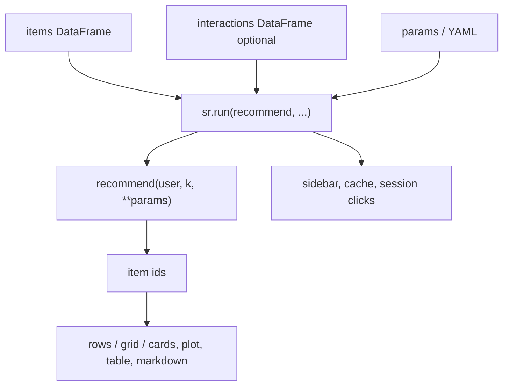

# Interfaces & contracts

Formal definitions for data shapes and call signatures used by `streamlit_recommenders`.  
The library accepts several **patterns** today; all of them must satisfy the same core contracts below.

See also: [CAPABILITIES.md](CAPABILITIES.md) | [README.md](../README.md)

### Overview

| | Researcher provides | Contract | Library output |
|---|---------------------|----------|----------------|
| **Catalog** | `items` DataFrame | [Section 2 Items](#2-items-catalog) | titles, images in layouts |
| **History** | `interactions` DataFrame (opt.) | [Section 3 Interactions](#3-interactions) | user picker, seen-item filter in your code |
| **Model** | `recommend(user, k, **params)` | [Section 1 Recommender](#1-recommender) | ranked item ids |
| **Tuning** | `params` / YAML | [Section 4 Params](#4-runtime-parameters) | sidebar widgets -> `**params` |
| **Metrics** | *(planned)* | [Section 6 Metrics](#6-metrics-planned-contract--not-implemented-in-mvp) | HR@k, NDCG, … via `sr.table()` |



---

## 1. Recommender

The central contract. Everything else in the library calls this.

### Signature

```python
def recommend(
    user_id: str | int,
    k: int,
    **params: float | int | str,
) -> list[str | int]:
    ...
```

| Rule | Detail |
|------|--------|
| **Input `user_id`** | Same type/values as in `interactions.user_id` (or sidebar selection) |
| **Input `k`** | Number of items to return; set by library from `num_recs` / `k` param |
| **Input `**params`** | Sidebar values **except** reserved keys (see Section 5) |
| **Return value** | Ordered list of item ids, **best first**, length ≤ `k` |
| **Id validity** | Each id should exist in the items catalog (unknown ids are skipped in UI) |
| **Determinism** | Same inputs -> same output (required for cache to behave predictably) |

### Protocol (library definition)

Defined in `streamlit_recommenders/models/protocol.py`:

```python
@runtime_checkable
class RecommenderProtocol(Protocol):
    def recommend(
        self,
        user_id: str | int,
        k: int,
        **params: float | int | str,
    ) -> list[str | int]: ...
```

### Accepted shapes (adapter)

`streamlit_recommenders/models/adapter.py` normalizes:

| Shape | Valid? | Example |
|-------|--------|---------|
| Plain function | Yes | `def recommend(user_id, k, alpha=0.5): ...` |
| Callable with extra `**params` | Yes | `def recommend(user_id, k, **params): ...` |
| Object with `.recommend()` | Yes | `class Model: def recommend(self, user_id, k, **params): ...` |
| Object with only `.predict()` | No | Wrap in a thin `recommend()` function |
| UI file upload | No | Load weights in Python, then implement `recommend()` |

### Pattern A — custom function (primary)

**Demo:** `examples/minimal_demo.py`

```python
def recommend(user_id: int, k: int, alpha: float = 0.5) -> list[int]:
    personal = USER_EMB[user_id] @ ITEM_EMB.T
    scores = alpha * personal + (1 - alpha) * POPULARITY
    seen = set(INTERACTIONS.loc[INTERACTIONS.user_id == user_id, "item_id"])
    ranked = np.argsort(scores)[::-1]
    return [int(i) for i in ranked if i not in seen][:k]
```

Param `alpha` comes from `params={"alpha": sr.slider(...)}` and is passed into `recommend` automatically.

### Pattern B — serialized object + wrapper

**Demo:** `examples/pickle_demo.py` | **Model class:** `examples/generate_sample_data.py`

```python
class SimpleRecommender:
    def recommend(self, user_id, k, **params):
        seen = set(self.interactions_df.loc[
            self.interactions_df.user_id == user_id, "item_id"
        ])
        ranked = self.popularity.sort_values(ascending=False)
        return [int(i) for i in ranked.index if i not in seen][:k]

MODEL = joblib.load("model.pkl")

def recommend(user_id, k, **params):
    return MODEL.recommend(user_id, k, **params)
```

### Pattern C — precomputed scores

**Demo:** `examples/matrix_demo.py`

```python
def recommend(user_id: int, k: int, min_score: float = 0.0, **params) -> list[int]:
    seen = set(INTERACTIONS.loc[INTERACTIONS.user_id == user_id, "item_id"])
    user_scores = SCORES.loc[SCORES.user_id == user_id]
    user_scores = user_scores[~user_scores.item_id.isin(seen)]
    user_scores = user_scores[user_scores.score >= min_score]
    return user_scores.sort_values("score", ascending=False).item_id.head(k).tolist()
```

**Scores table contract** (long format):

| Column | Type | Required |
|--------|------|----------|
| `user_id` | int or str | Yes |
| `item_id` | int or str | Yes |
| `score` | float | Yes |

Wide matrix `(users × items)` is not loaded by the library — reshape to long format in your demo script.

---

## 2. Items catalog

Passed to `sr.run(items=...)` and layout functions.

### Default schema

| Column | Required | Purpose |
|--------|----------|---------|
| `item_id` | Yes | Primary key; must match ids returned by `recommend()` |
| `title` | recommended | Display name |
| `image_url` | optional | Image in layouts |
| `description` | optional | Subtitle / card body |
| *any others* | optional | Ignored by layouts unless mapped |

### Example (generated sample data)

From `examples/generate_sample_data.py` -> `examples/sample_data/items.csv`:

```python
pd.DataFrame({
    "item_id": [0, 1, 2, ...],
    "title": ["Item 0", "Item 1", ...],
    "image_url": ["https://...", ...],
    "description": ["Description for item 0", ...],
    "category": ["A", "B", ...],  # extra column — fine
})
```

### Column mapping

If your columns use different names, map them via `item_columns` or YAML:

```yaml
item_columns:
  id: product_id      # logical "id" -> your column
  title: name
  image: poster_url
  description: synopsis
```

Logical keys (fixed): `id`, `title`, `image`, `description`.  
Defaults in code: `streamlit_recommenders/layouts/_helpers.py` -> `DEFAULT_COLUMNS`.

---

## 3. Interactions

Optional argument to `sr.run(interactions=...)`.

### Schema

| Column | Required | Purpose |
|--------|----------|---------|
| `user_id` | Yes (if provided) | Populates sidebar user selectbox |
| `item_id` | Yes (if provided) | Used by researchers to filter already-seen items |
| `rating`, `timestamp`, … | optional | Not used by library MVP; free for your model/metrics |

### Example

```python
pd.DataFrame({
    "user_id": [0, 0, 1, ...],
    "item_id": [3, 7, 1, ...],
    "rating": [4, 5, 3, ...],
})
```

If `interactions` is omitted, the sidebar falls back to an item-id selectbox (limited demo mode).

---

## 4. Runtime parameters

Sidebar values flow: **widget -> resolved dict -> `recommend(**params)`**.

### Reserved keys (consumed by `runner.py`, not forwarded to model)

| Key | Source | Purpose |
|-----|--------|---------|
| `num_recs` or `k` | slider / selectbox / YAML | Becomes argument `k` to `recommend()` |
| `layout` | selectbox (optional) | `rows` \| `grid` \| `cards` — UI only |

All other keys in `params` are passed to `recommend(user_id, k, **params)`.

### Imperative definition

```python
params={
    "alpha": sr.slider("alpha", 0.0, 1.0, 0.5),      # -> ParamSpec
    "num_recs": sr.selectbox("num_recs", [5, 10, 20]), # reserved
    "layout": sr.selectbox("Layout", ["rows", "grid", "cards"]),  # reserved
}
```

`ParamSpec` is defined in `streamlit_recommenders/widgets/params.py`.

### Declarative definition (YAML)

```yaml
params:
  - name: alpha
    type: slider
    min: 0.0
    max: 1.0
    default: 0.5
  - name: num_recs
    type: selectbox
    options: [5, 10, 20]
    default: 10
```

Supported `type` values today: `slider`, `selectbox`.

---

## 5. Layout output

`recommend()` returns **ids only**. Layouts join ids with the items catalog:

```
rec_ids = [3, 7, 1, ...]
items DataFrame + item_columns -> render title, image, description
```

Layout names: `rows`, `grid`, `cards` — see `streamlit_recommenders/layouts/__init__.py`.

---

## 6. Metrics *(planned contract — not implemented in MVP)*

The library does **not** compute metrics yet. This is the intended interface for a future `sr.metrics()` block.

### Signature

```python
def metric(
    *,
    interactions: pd.DataFrame,
    recommendations: dict[str | int, list[str | int]],  # user_id -> ranked ids
    k: int,
    **params,
) -> float | pd.DataFrame:
    ...
```

Or as a protocol:

```python
class MetricProtocol(Protocol):
    name: str

    def compute(
        self,
        interactions: pd.DataFrame,
        recommendations: dict[str | int, list],
        k: int,
    ) -> float: ...
```

### Expected inputs

| Field | Contract |
|-------|----------|
| `interactions` | Ground truth — at minimum `user_id`, `item_id`; binary relevance or ratings |
| `recommendations` | Output of your model per user — same id types as catalog |
| `k` | Cutoff for `@k` metrics |

### Planned built-ins

| Metric | Definition sketch |
|--------|-------------------|
| **HR@k** | Hit rate: any relevant item in top-k |
| **NDCG@k** | Normalized DCG with graded or binary relevance |
| **Coverage** | Fraction of catalog appearing in any recommendation list |

Until implemented, compute metrics in your `body()` callback with plain pandas/numpy and display via `sr.table()`.

---

## 7. Session events *(partial — state only)*

Click handlers in layouts call `record_click(item_id)` -> `session_state.clicked_items`.

| Field | Type | Purpose |
|-------|------|---------|
| `current_user` | str \| int | Last selected user |
| `clicked_items` | list | Item ids clicked in this session |

**Not yet wired:** feeding `clicked_items` back into `recommend()`. Researchers can read session state in a future API or manually extend their demo.

---

## Quick checklist before `sr.run()`

- [ ] `items` DataFrame has an id column (default `item_id`)
- [ ] `recommend(user_id, k, **params)` returns a list of those ids, length ≤ k
- [ ] Param names in `params` match arguments your function expects
- [ ] `num_recs` / `k` set how many items to request
- [ ] `interactions` provided if you need a user picker or seen-item filtering
- [ ] Id types consistent across items, interactions, scores, and return values (all int or all str)
