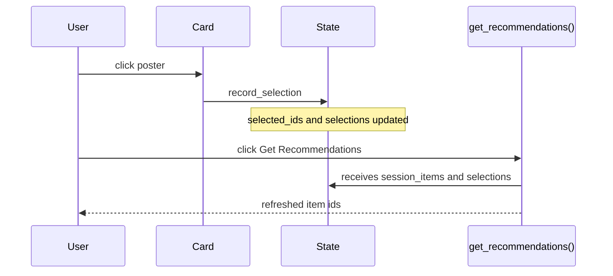

# Interfaces & contracts

Formal data shapes and signatures. Overview: [CAPABILITIES.md](CAPABILITIES.md).

## Data

`Dataset` is a small pandas bundle:

```python
sr.Dataset(
    items=items,
    interactions=train,
    users=users,
    test=test,
)
```

| Table | Required columns | Optional columns |
|-------|------------------|------------------|
| `items` | `item_id` | `title`, `image_url`, `description`, domain metadata |
| `users` | `user_id` | segment/profile columns |
| `interactions` / `train` / `test` | `user_id`, `item_id` | `rating`, `timestamp` |

Use `ColumnMap` when your data uses different names. `validate_dataset()` checks required columns and id consistency.

### Item metadata

Only `item_id` is required. The display layer uses the following optional columns when present:

| Column | Purpose | Fallback |
|--------|---------|----------|
| `title` | Card hover title and profile labels | `item_id` |
| `image_url` | Poster/card image | built-in placeholder |
| `description` | Card tooltip | `title` |

Movie-like datasets can carry extra metadata without changing the core contract, for example `genres`, `year`, `tmdb_id`, `imdb_id`, `poster_path`, `popularity`, or `release_date`. Keep these as ordinary DataFrame columns and use them in `body()` for plots, diagnostics, or markdown appendix sections.

For local MovieLens-derived work, use a gitignored path such as:

```text
data/
  ml-32m/
    items.csv
    users.csv
    interactions.csv
    train_interactions.csv
    test_interactions.csv
    posters/
```

Do not commit MovieLens data or cached posters unless their license explicitly allows it. Commit only scripts/docs that describe how to recreate the local files.

## Recommender

```python
def get_recommendations(
    user_id: str | int,
    k: int,
    session_items: list[str | int] | None = None,
    selections: list[dict] | None = None,
    **params,
) -> list[str | int]:
    ...
```

Accepted shapes: plain function, callable, object with `.get_recommendations()`, or `{label: model}` for compare mode.

| Rule | Detail |
|------|--------|
| Return | Ordered item ids, best first, length ≤ `k` |
| Ids | Must exist in `items`; unknown ids are skipped |
| Params | Sidebar values except reserved keys |

Optional injected kwargs when accepted by signature:

| Kwarg | Content |
|-------|---------|
| `session_items` | Ordered ids from the session profile |
| `selections` | Per-section `{item_id, rank, source}` metadata |

Use `effective_seen(interactions, user_id, session_items)` for filtering. Artifact paths, model checkpoints, external API handles, or framework-specific objects are construction details of the adapter, not part of the core recommender protocol.

### External training frameworks

Heavy training frameworks are intentionally outside the core dependency set. Train in RecBole, Cornac, RecPack, LensKit, Elliot, or a paper repository, then expose the trained artifact through this contract:

```python
class TrainedModelAdapter:
    def get_recommendations(self, user_id, k, session_items=None, **params):
        ...
        return item_ids[:k]
```

Recommended baseline families:

| Family | Built-in lightweight class | Canonical citation |
|--------|----------------------------|--------------------|
| Item-item CF | `ItemKNNRecommender` | Deshpande & Karypis, ACM TOIS 2004 |
| Shallow linear CF | `EASERecommender` / `ELSARecommender` | Steck, WWW 2019 |
| Sequential CF | `SequentialCFRecommender` | SASRec, Kang & McAuley, ICDM 2018 |

## Runtime params

Reserved keys:

| Key | Purpose |
|-----|---------|
| `num_recs` / `k` | Passed as `k` |
| `layout` | `rows` \| `grid` \| `cards` |

YAML widget types: `slider`, `selectbox`.

## Layouts

All layouts render ids through the same poster-button card.

| Layout | Behaviour |
|--------|-----------|
| `rows` | Single horizontal row with fixed-width cards and side scroll |
| `cards` | Wrapped poster-card gallery for a single recommender |
| `grid` | Wrapped poster grid for catalog-style browsing |
| compare | Forced to `rows` |

Widget keys include rank: `streamlit_recommenders.item.{section}.{id}.r{rank}`. Duplicate ids are deduplicated before display; selected ids remain visible as greyed cards that can be clicked again to unselect.

## Session flow



Reader API in `body()`: `sr.selected_items()`, `sr.selections()`, `sr.current_user()`, `sr.param_value(name)`.

## Metrics

`sr.evaluate()` expects recommendations by user and held-out interactions:

```python
sr.evaluate(
    {"Model": {0: [1, 2, 3]}},
    test_interactions=test,
    k=10,
    all_item_ids=items.item_id,
)
```

Implemented: hit rate, recall, NDCG, MRR, coverage.

## Checklist

- [ ] ids are consistent across items/users/interactions/test
- [ ] `get_recommendations(user_id, k, **params)` returns ids from `items`
- [ ] model accepts `session_items` if it should react to card clicks
- [ ] params names match model arguments
