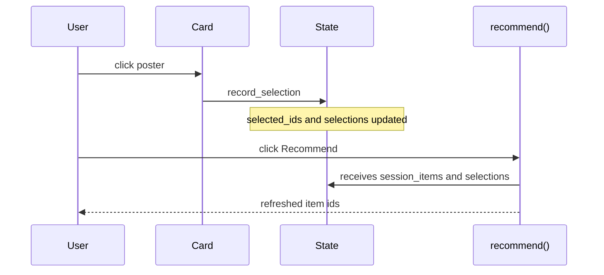

# Interfaces & contracts

Formal data shapes and signatures. Overview: [CAPABILITIES.md](CAPABILITIES.md).

## Data

`Dataset` is a small pandas bundle:

```python
sr.Dataset(
    items=items,
    interactions=train,
    users=users,
    test=test,
)
```

| Table | Required columns | Optional columns |
|-------|------------------|------------------|
| `items` | `item_id` | `title`, `image_url`, `description`, domain metadata |
| `users` | `user_id` | segment/profile columns |
| `interactions` / `train` / `test` | `user_id`, `item_id` | `rating`, `timestamp` |

Use `ColumnMap` when your data uses different names. `validate_dataset()` checks required columns and id consistency.

## Recommender

```python
def recommend(user_id: str | int, k: int, **params) -> list[str | int]:
    ...
```

Accepted shapes: plain function, callable, object with `.recommend()`, or `{label: model}` for compare mode.

| Rule | Detail |
|------|--------|
| Return | Ordered item ids, best first, length ≤ `k` |
| Ids | Must exist in `items`; unknown ids are skipped |
| Params | Sidebar values except reserved keys |

Optional injected kwargs when accepted by signature:

| Kwarg | Content |
|-------|---------|
| `session_items` | Ordered ids from the session profile |
| `selections` | Per-section `{item_id, rank, source}` metadata |

Use `effective_seen(interactions, user_id, session_items)` for filtering.

## Runtime params

Reserved keys:

| Key | Purpose |
|-----|---------|
| `num_recs` / `k` | Passed as `k` |
| `layout` | `rows` \| `grid` \| `cards` |

YAML widget types: `slider`, `selectbox`.

## Layouts

All layouts render ids through the same poster-button card.

| Layout | Behaviour |
|--------|-----------|
| `rows` | Single horizontal row with fixed-width cards and side scroll |
| `cards` | Same as `rows` |
| `grid` | Wrapped rows of 4 fixed-width cards |
| compare | Forced to `rows` |

Widget keys include rank: `streamlit_recommenders.item.{section}.{id}.r{rank}`. Duplicate ids are deduplicated before display; selected ids remain visible as disabled cards.

## Session flow



Reader API in `body()`: `sr.selected_items()`, `sr.selections()`, `sr.current_user()`, `sr.param_value(name)`.

## Metrics

`sr.evaluate()` expects recommendations by user and held-out interactions:

```python
sr.evaluate(
    {"Model": {0: [1, 2, 3]}},
    test_interactions=test,
    k=10,
    all_item_ids=items.item_id,
)
```

Implemented: hit rate, recall, NDCG, MRR, coverage.

## Checklist

- [ ] ids are consistent across items/users/interactions/test
- [ ] `recommend(user_id, k, **params)` returns ids from `items`
- [ ] model accepts `session_items` if it should react to card clicks
- [ ] params names match model arguments
