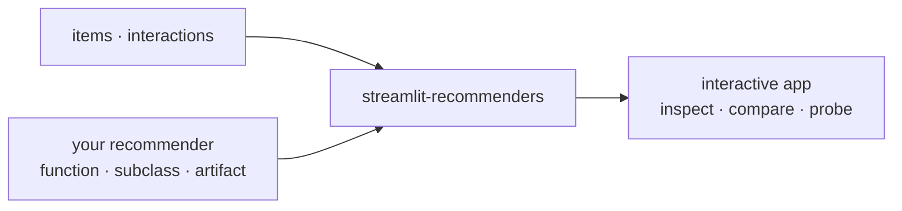
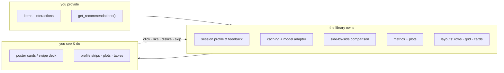
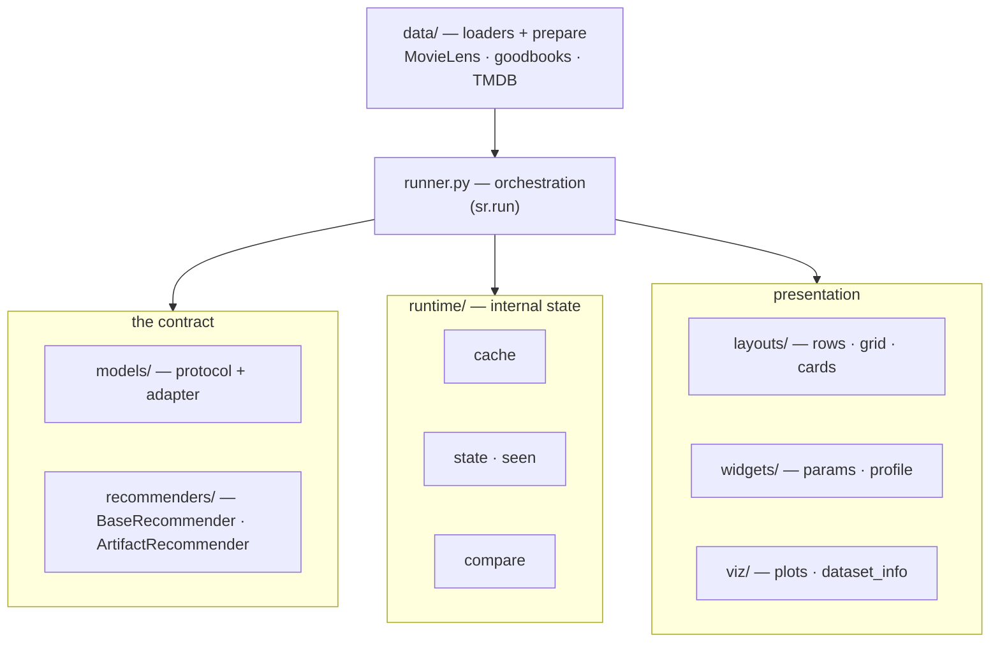

# Architecture

`streamlit-recommenders` is a thin layer between your recommender and an interactive demo: you
provide recommendations through one small contract, and the library owns everything interactive.
This page zooms in through three levels — the idea, who owns what, and the module map.

## Level 1 — The idea

You bring data and a way to produce ranked item ids; you get an app that lets anyone inspect,
compare, and probe the model.

## Level 2 — Who owns what, and the session loop

You own the data and the recommendations. The library owns the session profile, caching,
comparison, metrics, and layouts. What the user does on the page (click, like, dislike, skip) feeds
back into the profile and refreshes the recommendations.

The profile a model scores against is the union of the selected user's **history** and their
**current-session** likes; see **[Feedback & session](feedback.md)** for the exact signals,
seen-filtering, and fallback handling.

## Level 3 — Module map

One `sr.run(...)` call wires four groups together. Nothing model-specific lives in the library:
the contract is just `get_recommendations`, and the reference baselines are in `examples/`.

**Request flow:** sidebar params + selected user → cached `get_recommendations()` (via the adapter)
→ ranked item ids stored in session state → poster carousel / swipe deck. A click updates the
session profile; **Get Recommendations** recomputes every compared row against the same evidence.

## Boundary

The library owns the interactive inspection layer, not model training. Training frameworks
standardize offline experimentation; `streamlit-recommenders` standardizes how a trained
recommender is displayed, compared, and probed with session feedback.

- **Data prep lives in the library** (`streamlit_recommenders/data/prepare/`): `prepare_movielens`
  and `prepare_goodbooks` download and normalize into the local schema, TMDB enrichment is robust
  (retry/backoff, completeness report), and a `dataset.json` manifest (`is_complete`) makes
  preparation idempotent.
- **Models do not.** The library ships only the `BaseRecommender` contract and the
  `ArtifactRecommender` loader. Reference baselines live in `examples/reference_recommenders.py` as
  copy-and-adapt starting points; heavy frameworks stay external, reached through the contract.
