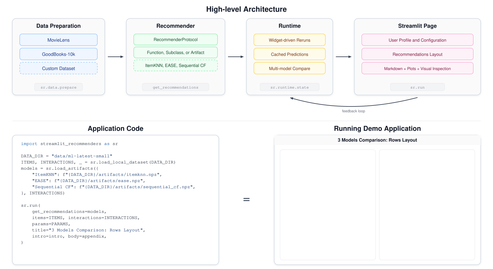

# streamlit-recommenders

**Turn a trained recommender into an interactive, inspectable web demo in a few lines of Python.**

`streamlit-recommenders` is a thin presentation layer between your recommendation model and an
interactive [Streamlit](https://streamlit.io) app. You bring a function (or object) that returns
ranked item ids; the library owns the UI, caching, session profile, side-by-side comparison, and
light evaluation. It ships **no models** — what recommends is entirely yours.



## Install

```bash
pip install streamlit-recommenders
```

## Quick start

```python
import streamlit_recommenders as sr

ITEMS = sr.load_items("data/items.csv")
INTERACTIONS = sr.load_interactions("data/interactions.csv")
POPULARITY = INTERACTIONS["item_id"].value_counts().index.tolist()

def get_recommendations(user_id, k, session_items=None, **params):
    exclude = set(session_items or [])
    return [item_id for item_id in POPULARITY if item_id not in exclude][:k]

sr.run(get_recommendations=get_recommendations, items=ITEMS, interactions=INTERACTIONS)
```

```bash
streamlit run app.py
```

## Where to next

- **[Capabilities](CAPABILITIES.md)** — the public API, layouts, dataset preparation.
- **[Contracts](CONTRACTS.md)** — data shapes, the recommender contract, and feedback signals.
- **[Architecture](ARCHITECTURE.md)** — how a demo flows through the library, in three levels.
- **[API reference](api.md)** — generated from the source docstrings.

For the three ways to plug in a recommender, dataset acquisition, and the examples, see the
project [README](https://github.com/vaclavstibor/streamlit-recommenders#readme).
